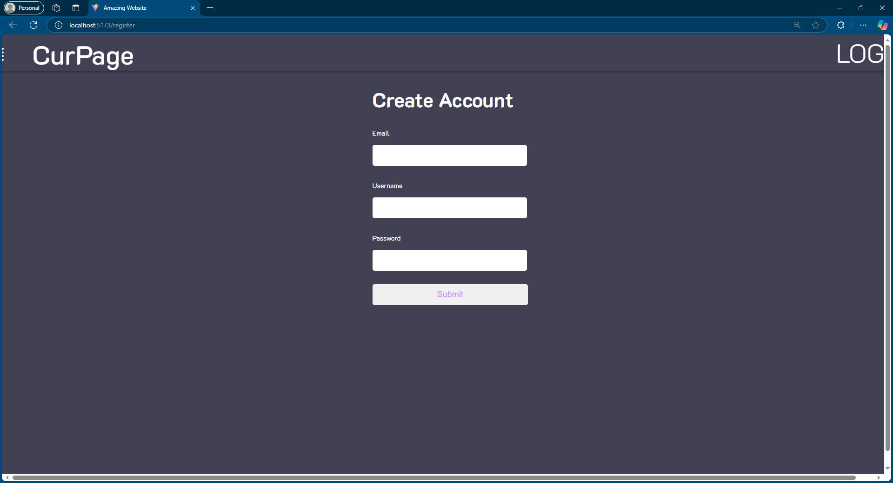
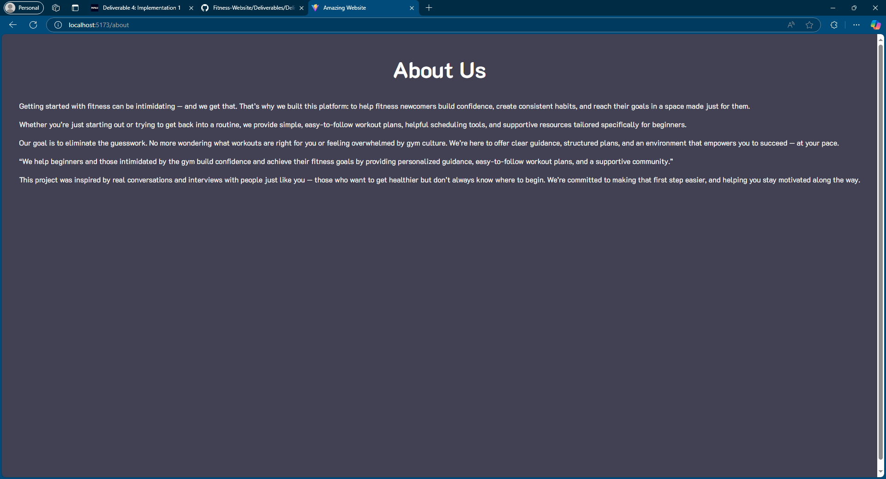
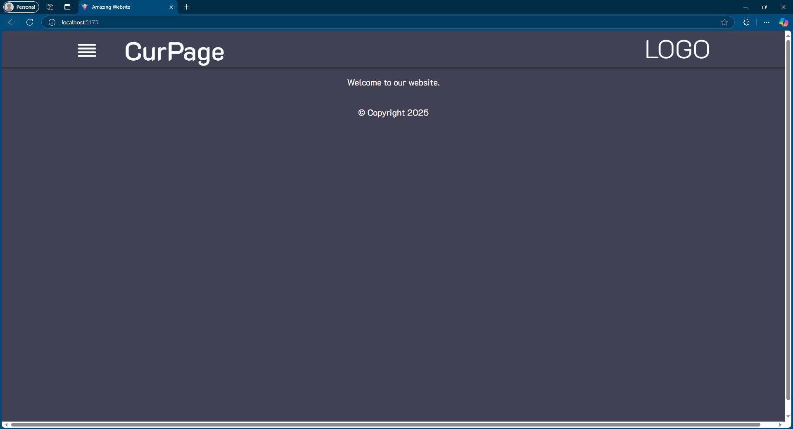
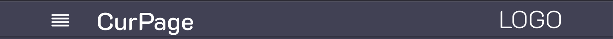
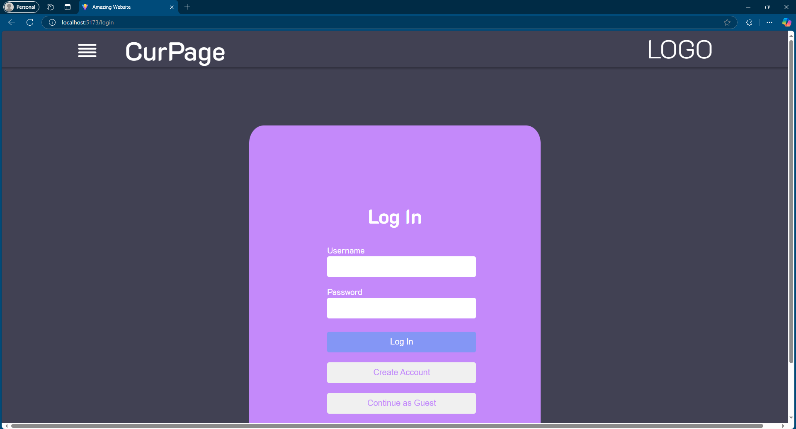
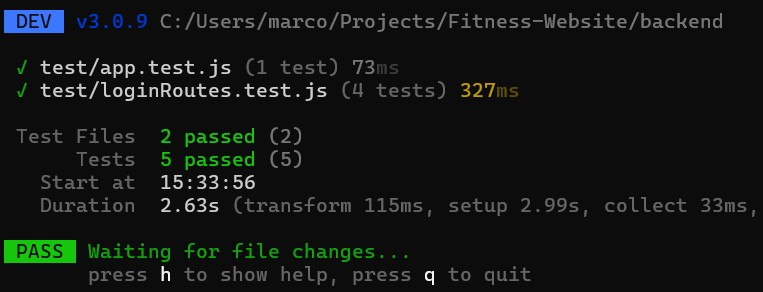
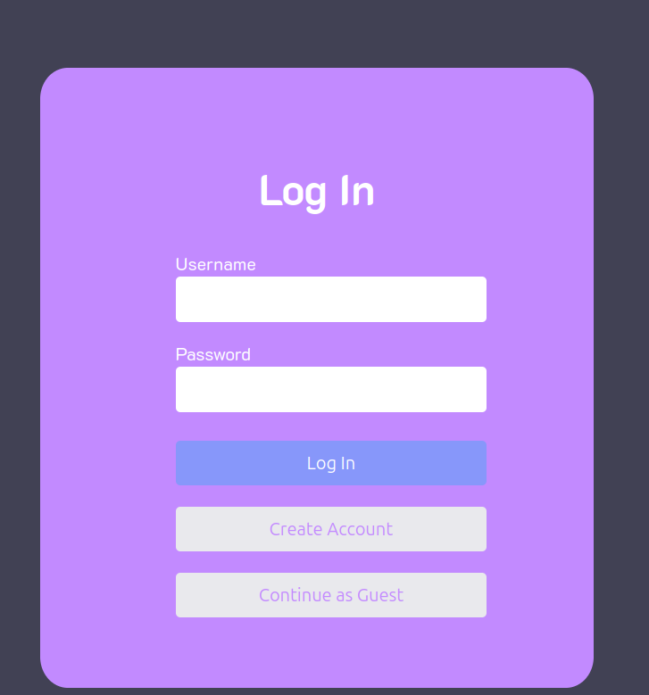
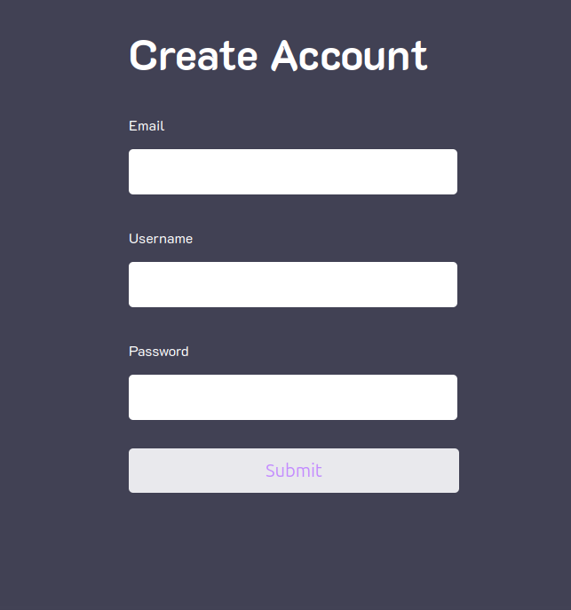

# Introduction

This project currently consists of an assortment of individual pages aimed to adhere to our predetermined goals as previously stated in our value statement, whcih goes as follow: We help fitness newcomers build confidence and independence by offering an online learning platform that teaches newcomers the best way to begin and supports them into becoming consistent. To accomplish this, an *About* page was created to inform any users of this project's value. The system also contains a *Create Account* and a *Login* page, creating fields for users to input their information when they wish to create an account or log back in to their account. <br>
Follow [this link](https://github.com/McKayHartman/Fitness-Website) to view the current state of this project.


# Requirements

Requirement: As an interested fitness newcomer, I want to be able to create a personal account. <br>
Issue: https://github.com/McKayHartman/Fitness-Website/issues/65 <br>
Pull request: https://github.com/McKayHartman/Fitness-Website/pull/77 <br>
Implemented by: Bryce Panza <br>
Approved by: Lacy Hamilton <br>
Print screen:  <br>


Requirement: As a new user, I would like to gather information about the site and its purpose. <br>
Issue: https://github.com/McKayHartman/Fitness-Website/issues/103 <br>
Pull request: https://github.com/McKayHartman/Fitness-Website/pull/87 <br>
Implemented by: Christian Lamb <br>
Approved by: Lacy Hamilton <br>
Print screen:  <br>


Requirement: As a web user, I would like to be able to be directed to the homepage when visiting site. <br>
Issue: [#71](https://github.com/McKayHartman/Fitness-Website/issues/71) <br>
Pull request: [#72](https://github.com/McKayHartman/Fitness-Website/pull/72) <br>
Implemented by: Lacy Hamilton <br>
Approved by: McKay Hartman <br>
Print screen:  <br>


Requirement: As a web user I would like to be able to navigiate through the website and see what page I am on<br>
Issue: [#100](https://github.com/McKayHartman/Fitness-Website/issues/100) <br>
Pull request: [#59](https://github.com/McKayHartman/Fitness-Website/pull/59)<br>
Implemented by: Logan Hunt <br>
Approved by: Lacy Hamilton <br>
Print screen:  <br>


Requirement: As a web user, I would like to be able to navigate through different pages.<br>
Issue: [#88](https://github.com/McKayHartman/Fitness-Website/issues/88) <link to your GitHub issue> <br>
Pull request: [#78](https://github.com/McKayHartman/Fitness-Website/pull/78) <br>
Implemented by: Marco de la Rosa <br>
Approved by: Lacy Hamilton <br>


Requirement: As a frequent web user I would like to be able to log in to my account to access my personal settings and data. <br>
Issue: [#70](https://github.com/McKayHartman/Fitness-Website/issues/70) <br>
Pull request: [#74](https://github.com/McKayHartman/Fitness-Website/pull/74) <br>
Implemented by: McKay Hartman <br>
Approved by: Lacy Hamilton <br> 
Print screen:  <br>


# Tests

We used the Vitest framework for testing the project. For HTTP testing, we also used the Supertest library in order to simulate HTTP requests. The unit tests are stored in the [backend/test](https://github.com/McKayHartman/Fitness-Website/tree/main/backend/test)  folder. 

A simple example of a unit test case is such: the "[sameHash](https://github.com/McKayHartman/Fitness-Website/blob/main/backend/test/auth.test.js)" test tests if a hash comparison function works correctly by hashing a string and immediately comparing it with itself using the function.

```
test('sameHash', async () => {
    expect(await sameHash('x', await hash('x'))).toBe(true);
})
```

Here are the results of the tests being run.


# Technology

The list of adopted technologies our project utilizes is the following:

- React: We are using React to write out JavaScript and HTML in order to make working on the frontend more object oriented as we are able to make components. <br>
- Vite: We are using Vite as our development server in order to preview our React UI, and bundle the pages for production.
- SQLite: We are using SQLite for our database, as it is simple to deploy and works well for a smaller project such as this.<br>
- pnpm: We are using pnpm as our package manager to better manage our disk space during project development. <br>
- Node.js: We are using Node.js to be our JavaScript runtime enviorment as we have previous experience using. <br>
- Figma: We used Figma to finalize the website design for our UX Design as we wanted to be able to make a mockup of what we wanted our site to look like. <br>
- Azure: We are using Microsoft Azure to host our website as many of us have experience using this platform from previous coursework. <br>

# Deployment

https://fitnesswebsite.z13.web.core.windows.net/

# Licensing

We adopted a MIT License as we just wanted to have a simple license. The MIT License only involces conditions requiring preservation of copyright and license notices whereas licensed works, larger works, or modification can be distrubted under different terms without source code.

# Readme File

[CONTRIBUTING.md](https://github.com/McKayHartman/Fitness-Website/blob/main/README.md) <br>
[LICENSE](https://github.com/McKayHartman/Fitness-Website/blob/main/LICENSE) <br>
[CODE_OF_CONDUCT.md](https://github.com/McKayHartman/Fitness-Website/blob/main/CODE_OF_CONDUCT.md) <br>

# UX Design
For our user interface, we planned out basic design using tools like Figma. The UX should be intuitive and simplistic to streamline the process of creating accounts and accessing features. Much of the design is tied to inherited variables so that we can change things like colors globally if we choose to do so.





# Lessons Learned

In retrospect, the team has significantly improved their skills, especially in using React JS and GitHub. We started out disorganized, not utilizing features that would streamline the process.

We added protections to the main branch, so that pull requests would have to be reviewed before merging. This caused us to look at each others code more than we were and catch mistakes.

The team has also improved their workflow by better assigning tasks appropriate to each memeber's specific skill set. Specialization helps the team more quickly move through the development process because issues are delegated to people who know how to handle them.

# Demo

[Youtube Video](https://youtu.be/Zol3ltbpPQY)
