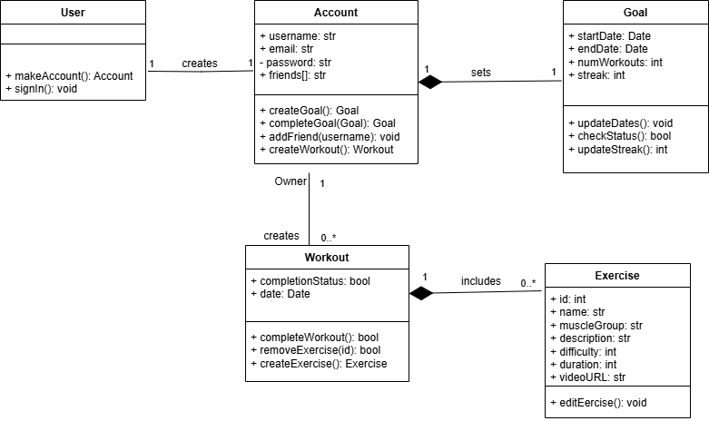
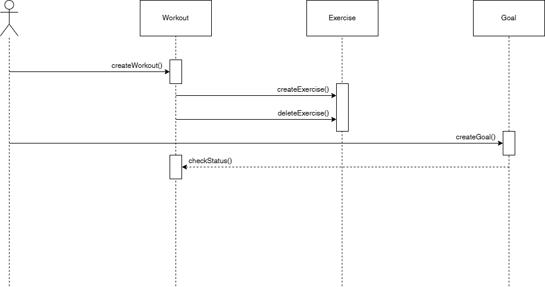

### Description

Fitness planning can be challenging for many people, leading to irregular and unproductive workout sessions that hinder progress. For internet users who struggle with fitness planning, our website Fitness Website, provides a free solution that centralizes and automates all functions of creating effective workout plans with diverse exercises. We aim to empower fitness newcomers by offering a comprehensive platform that guides them in setting and achieving goals, building confidence and independence along the way.

Our system includes an accounts module ensuring that only authorized users can access their accounts using a correct password. Users register by supplying a unique username and email, and then log in to manage their personalized workouts. A workout contains several exercises. Users can schedule and update daily workouts, within their account which monitors completion rates. Furthermore, the goal system analyzes past workout data and suggests new routines based on specific workout tags that classify exercises by attributes like name, duration, muscle groups, and intensity. Beyond individual progress, the system encourages the community aspect of our website by enabling users to connect with friends, share achievements, and mutually support one another. Designed for both desktop and mobile use, the system emphasizes portability, usability, and minimal downtime to provide a seamless, fitness experience.

### Architecture

Present a diagram of the high-level [architecture](https://en.wikipedia.org/wiki/List_of_software_architecture_styles_and_patterns) of your system. Use a UML package diagram to describe the main modules and how they interrelate. See some examples at:

[https://www.uml-diagrams.org/package-diagrams-examples.html Links to an external site.](https://www.uml-diagrams.org/package-diagrams-examples.html)

Make clear the layers of your architecture (if they exist) as described in:

[https://www.uml-diagrams.org/multi-layered-application-uml-model-diagram-example.html Links to an external site.](https://www.uml-diagrams.org/multi-layered-application-uml-model-diagram-example.html)

[Links to an external site.](https://www.uml-diagrams.org/multi-layered-application-uml-model-diagram-example.html)Provide a brief rationale of your architecture explaining why you designed it that way. 

_Grading criteria (5 points):_ Adequate use of UML; Adequate design of an architecture for the system; Adequate description of the rationale.

### Class Diagrams

### Sequence Diagrams

### **Use Case: Workout Logging**

- **Actor**: User
- **Precondition**: The user is logged into their account.
- **Description**: The user can log workouts.
- **Flow of Events**:
  1. The user accesses the diary page.
  2. The user enters workout details and saves it.
  3. The system updates the diary to reflect the new workout.
  4. The user's goals are then updated to show the completed progress.
- **Postcondition**: The workout is successfully added to the calendar.

### Design Patterns

Split this section into 2 subsections. For each subsection, present a UML class diagram showing the application of a [design pattern](https://sourcemaking.com/design_patterns) to your system (a different pattern for each section). Each class diagram should contain only the classes involved in the specific pattern (you don’t need to represent the whole system). Choose patterns from two different categories: Behavioral, Structural, and Creational. You are not limited to design patterns studied in class. 

Your system may not be appropriate for any design pattern. In this case, for didactic purposes, be creative and extend a little bit the scope of your system to make the design patterns appropriate. 

Implement each design pattern in your system and provide GitHub links to the corresponding classes. Example (the links are just illustrative):

- Car: [https://github.com/user/repo/blob/master/src/com/proj/main/Car.java Links to an external site.](https://github.com/user/repo/blob/master/src/com/proj/main/Car.java)
- IBreakBehavior: [https://github.com/user/repo/blob/master/src/com/proj/main/IBreakBehavior.javaLinks to an external site.](https://github.com/user/repo/blob/master/src/com/proj/main/IBreakBehavior.java)
- BrakeWithABS: [https://github.com/user/repo/blob/master/src/com/proj/main/BrakeWithABS.javaLinks to an external site.](https://github.com/user/repo/blob/master/src/com/proj/main/BrakeWithABS.java)
- Brake: [https://github.com/user/repo/blob/master/src/com/proj/main/Brake.javaLinks to an external site.](https://github.com/user/repo/blob/master/src/com/proj/main/Brake.java)

_Grading criteria (6 points, 3 points for each pattern):_ Correct use of the design pattern as described in the literature; Adequate choice of the design pattern; Adequate implementation of the design pattern.

### Design Principles

1.	**Open-Closed Principle** - The open-closed principle specifies that software should enable programmers to make additions without having to change the existing code. Our website uses the open-closed principle through its utilization of React JS. React allows us, as programmers to reuse components. For example, if we want to add a new page, we are able to do this more efficiently as we can just reuse components from previous pages. This extends the software while minimizing restructuring of existing code. For a class example, the User class is able to inherit the classes of admin, personal trainer, or basic. This follows the principle because it means that the User class does not have to be modified, and it can just be extended to accommodate the other three types of account.
2.	**Single Responsibility Principle** - The single responsibility principle states that each class should have one responsibility. There should not be any "monolithic" classes that encompass multiple responsibilities that could otherwise be divided into multiple classes. Our fitness website follows this principle because it divides responsibility of classes to one per. For example, there is a separate workout class and exercise class. This allows for the division of the responsibility of storing the workout date, and completion status into the workout class; the exercise class is then free to be responsible for the details of the of exercise, including muscle group, difficulty, video representation, etc.
3.	**Interface Segregation Principle** - The interface segregation principle states that interfaces should be broken up and only depend on what they absolutely need. One example is with the Consistency Goal class. Users are able to see their goal, but the class is only dependent on their goal streak and dates. By separating this from the workout or account class, we minimize the number of responsibilities the Consistency Goal class has, and overall improves the security and efficiency of the website.

