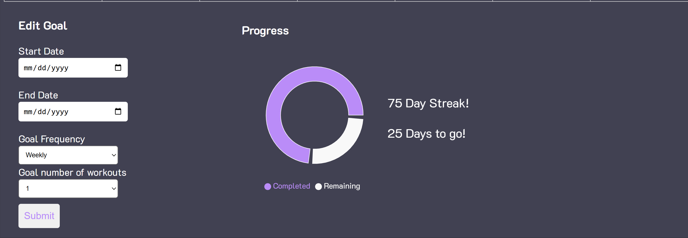

## Introduction
Version 1 of this project consisted of an assortment of individual pages aimed to adhere to our predetermined goals as previously stated in our value statement, which goes as follow: We help fitness newcomers build confidence and independence by offering an online learning platform that teaches newcomers the best way to begin and supports them into becoming consistent. For version 2 of our project, we focused on enhancing user experience in order to increase this project's value. We now have a functional system that contains a proper Create Account and a Login page which users can use an email and password to log into, an improved backend with a working database to store the values, refined UI for current pages and header navigation, and a calendar function.

Follow this [link](https://github.com/McKayHartman/Fitness-Website) to view the current state of this project.

## Requirements
List in this section, the requirements and associated pull request that you implemented for this release, following the example below---include the description of the requirement, a link to the issue,  a link to the pull request(s) that implement the requirement, who implemented the requirement, who approved it, and a print screen that depicts the implemented feature (if applicable). Order the requirements by the name of the student who implemented them.

We expect that you implement/prototype the features you specified in your MVP (c.f. D.2 Requirements). We expect that all the members of the group have been involved in some programming activities and report here several pull requests. 

Example:

Requirement: As a Student, I want to add a homework assignment so that I can organize my ToDo list.
Issue: <link to your GitHub issue>
Pull request: https://github.com/user/project/pull/426
Implemented by: Martin Fowler
Approved by: Ada Lovelace
Print screen: A print screen that depicts the implemented feature (if applicable)

Remember that all source code should be submitted by means of pull requests and the quality assurance person in the team should review and approve each pull request. For more information about pull requests:
https://help.github.com/articles/about-pull-requests  

Grading criteria (20 points): This section will be evaluated in terms of correctness, completeness, thoroughness, consistency, coherence, adequate use of language, and amount of work put into the implementation. Students can receive different grades depending on their involvement. It is expected that all members contribute with non-trivial implementation. All pull requests should be approved and integrated by the quality assurance person. You should follow an adequate workflow (description of the requirement on the issue tracker, submission of the implemented requirement as a pull request, and review of the pull request by another developer). 

Requirement: As a new user, I would like to have a welcoming homepage to visit that catches my eye.  
Issue: [#152](https://github.com/McKayHartman/Fitness-Website/issues/152)  
Pull request: [#156](https://github.com/McKayHartman/Fitness-Website/pull/156)  
Implemented by: Lacy Hamilton  
Approved by: Bryce Panza  
Print screen:   

Requirement: As a user, I want there to be a field to track my progress and edit my own consistency goals.  
Issue: [#153](https://github.com/McKayHartman/Fitness-Website/issues/153)  
Pull Request: [#154](https://github.com/McKayHartman/Fitness-Website/pull/154)
Implemented by: Bryce Panza  
Approved by: Lacy Hamilton  
Print screen:   

## Tests
You should implement automated tests for the features described in the previous subsection. Provide the following information:

Test framework you used to develop your tests (e.g., JUnit, unittest, pytest, etc.)
Link to your GitHub folder where your automated unit tests are located.
An example of a test case. Include in your answer a GitHub link to the class being tested and to the test.
A print screen showing the result of the automated tests execution. 
Grading criteria (3 points): You should have an adequate number of automated tests. They should be well written and match the features implemented in the aforementioned pull requests.

## Demo
Include a link to a video showing the system working.

Grading criteria (10 points): This section will be graded based on the quality of the video and on the evidence that the features are running as expected. Additional criteria are the relevance of the demonstrated functionalities, the correctness of the functionalities, and quality of the developed system from the external point of view (user interface).

## Code quality
Our team prioritized code quality by implementing several key practices. We used clear and descriptive comments to explain complex or less intuitive sections of code, ensuring that all team members could easily understand and navigate the project. Additionally, we adopted a convention of assigning meaningful and consistent names to variables and components, promoting clarity and enabling seamless collaboration across the team when working on shared components. We also made a concerted effort to refactor code from our first release, improving its structure, efficiency, and maintainability. These practices collectively allowed us to enhance the readability, functionality, and overall quality of our codebase.

## Lessons Learned
Looking back on the second release, our team made significant progress in improving our problem-solving abilities, particularly in bridging the gap between frontend and backend communication. We intially struggled with disorganization, as not all members had a good understanding of the backend and how to make the frontend functionalities fully operational. Through collaboration and persistence, several of our team members worked together to ensure the 'Create Account' and 'Login' pages could effectively communicate with the database. By prioritizing teamwork, we were able to tackle this release earlier and focused on completing our minimum viable products while eliminating features that would have caused unnecessary delays.

If we were to continue developing the project, our main goal would be to enhance the user experience with more impactful and personalized features. Currently, after the second release, the platform remains fairly basic. Users can create an account and log in, but beyond that, the functionality is not tailored to individual users. In the future, adding features such as personalized workout recommendations or allowing users to input and save their own workouts to the database would be valuable enhancements to the site that align with our mission to support fitness newcomers.
