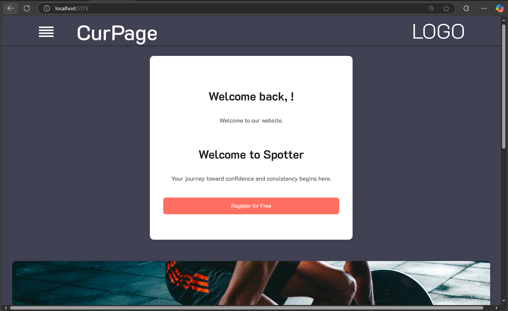
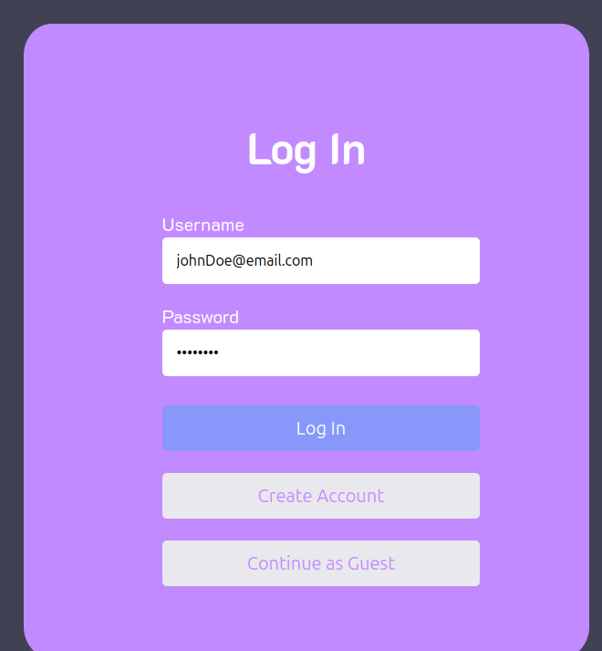
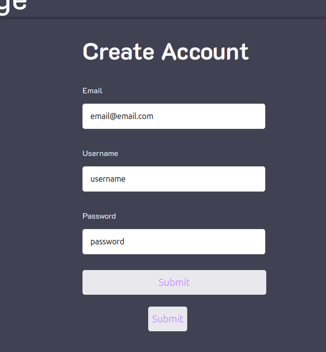
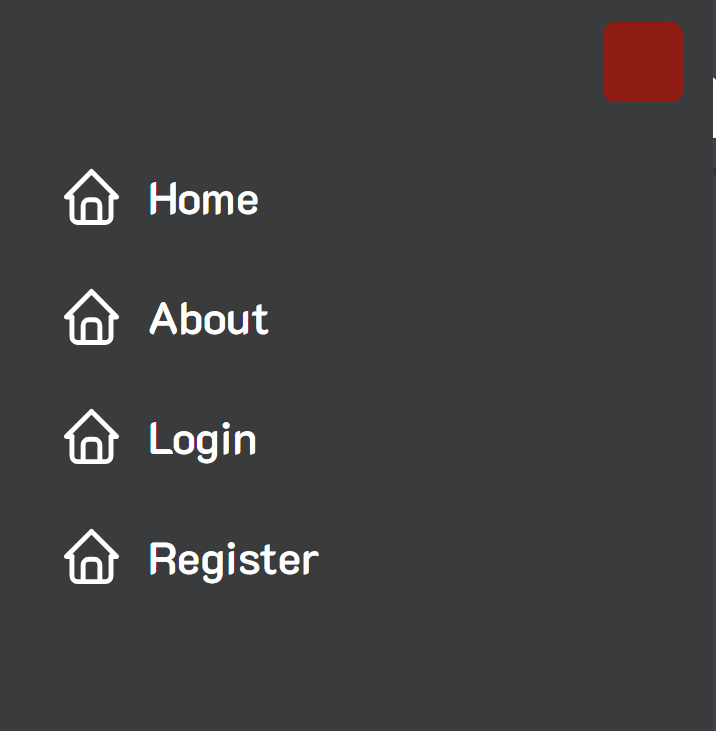
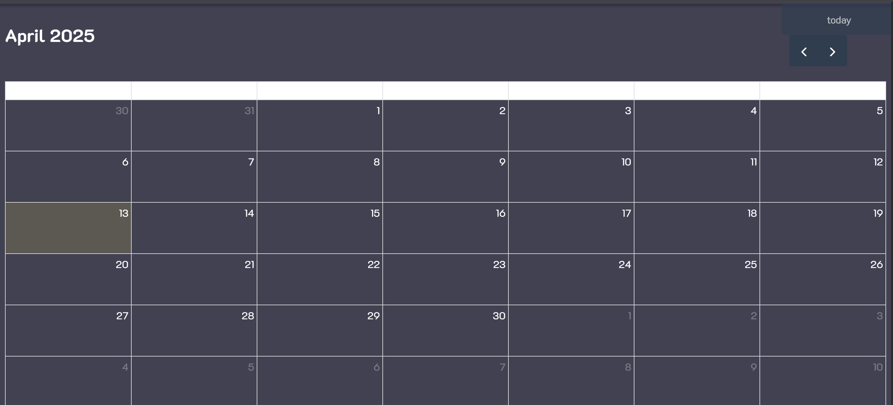
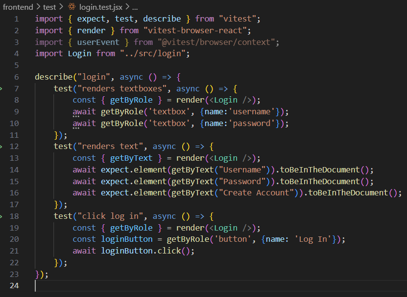
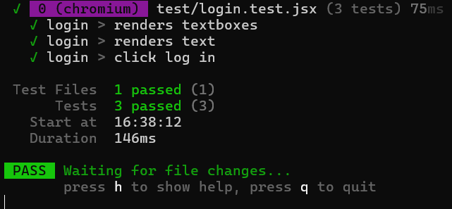

## Introduction
Version 1 of this project consisted of an assortment of individual pages aimed to adhere to our predetermined goals as previously stated in our value statement, which goes as follow: We help fitness newcomers build confidence and independence by offering an online learning platform that teaches newcomers the best way to begin and supports them into becoming consistent. For version 2 of our project, we focused on enhancing user experience in order to increase this project's value. We now have a functional system that contains a proper Create Account and a Login page which users can use an email and password to log into, an improved backend with a working database to store the values, refined UI for current pages and header navigation, and a calendar function.

Follow this [link](https://github.com/McKayHartman/Fitness-Website) to view the current state of this project.

## Requirements

Requirement: As a new user, I would like to have a welcoming homepage to visit that catches my eye.  
Issue: [#152](https://github.com/McKayHartman/Fitness-Website/issues/152)  
Pull request: [#156](https://github.com/McKayHartman/Fitness-Website/pull/156)  
Implemented by: Lacy Hamilton  
Approved by: Bryce Panza  
Print screen:  
  

Requirement: As a frequent user, I would like to have a simple and quick login system so I can easily access my homepage.  
Issue: [#2](https://github.com/McKayHartman/Fitness-Website/issues/2)  
Pull request: [#158](https://github.com/McKayHartman/Fitness-Website/pull/158)  
Implemented by: McKay Hartman  
Approved by: Christian Lamb  
Print screen:  
  

Requirment: As a new user, I would like to be able to create a new, secure account so I can log in.  
Issue: [#70](https://github.com/McKayHartman/Fitness-Website/issues/70)  
Pull request: [#158](https://github.com/McKayHartman/Fitness-Website/pull/158)  
Implemented by: McKay Hartman  
Approved by: Christian Lamb  
Print screen:  
  

Requirement: As a user, I would like to be able to easily navigate through the different pages of the website.  
Issue: [#147](https://github.com/McKayHartman/Fitness-Website/issues/147)  
Pull Request: [#146](https://github.com/McKayHartman/Fitness-Website/pull/146)  
Implemented by: Logan Hunt  
Approved by: Lacy Hamilton  
Print screen:  
  

Requirement: As a user, I want there to be a field to track my progress and edit my own consistency goals.  
Issue: [#153](https://github.com/McKayHartman/Fitness-Website/issues/153)  
Pull Request: [#154](https://github.com/McKayHartman/Fitness-Website/pull/154)  
Implemented by: Bryce Panza  
Approved by: Lacy Hamilton  
Print screen:  
  

Requirement: As a user, I want there to be a field to track my progress and edit my own consistency goals.  
Issue: [#168](https://github.com/McKayHartman/Fitness-Website/issues/168)  
Pull Request: [#150](https://github.com/McKayHartman/Fitness-Website/pull/150)  
Implemented by: Marco de la Rosa  
Approved by: Lacy Hamilton  
Print screen:  
  

## Tests

All of the added requirements in this section were frontend, browser features. As such, we used vitest (a react-based testing framework) with browser mode. The tests are stored [here](https://github.com/McKayHartman/Fitness-Website/tree/main/frontend/test).
For an example test case, here is the testing for the login page. The file is [here](https://github.com/McKayHartman/Fitness-Website/tree/main/frontend/test/login.test.jsx).

This is a simple test case, testing the login frontend by testing if the elements are present, and can be interacted with.
Here is the result of the test case execution:

### Demo

Watch the video on [YouTube](https://www.youtube.com/watch?v=uNh5QDWfY8Q)

## Code quality
Our team prioritized code quality by implementing several key practices. We used clear and descriptive comments to explain complex or less intuitive sections of code, ensuring that all team members could easily understand and navigate the project. Additionally, we adopted a convention of assigning meaningful and consistent names to variables and components, promoting clarity and enabling seamless collaboration across the team when working on shared components. We also made a concerted effort to refactor code from our first release, improving its structure, efficiency, and maintainability. These practices collectively allowed us to enhance the readability, functionality, and overall quality of our codebase.

## Lessons Learned
Looking back on the second release, our team made significant progress in improving our problem-solving abilities, particularly in bridging the gap between frontend and backend communication. We intially struggled with disorganization, as not all members had a good understanding of the backend and how to make the frontend functionalities fully operational. Through collaboration and persistence, several of our team members worked together to ensure the 'Create Account' and 'Login' pages could effectively communicate with the database. By prioritizing teamwork, we were able to tackle this release earlier and focused on completing our minimum viable products while eliminating features that would have caused unnecessary delays.

If we were to continue developing the project, our main goal would be to enhance the user experience with more impactful and personalized features. Currently, after the second release, the platform remains fairly basic. Users can create an account and log in, but beyond that, the functionality is not tailored to individual users. In the future, adding features such as personalized workout recommendations or allowing users to input and save their own workouts to the database would be valuable enhancements to the site that align with our mission to support fitness newcomers.
