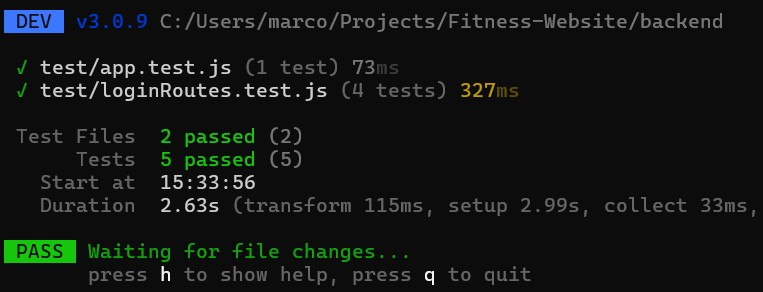

## Description
Fitness planning can be challenging for many people, leading to irregular and unproductive workout sessions that hinder progress. For internet users who struggle with fitness planning, our website Fitness Website, provides a free solution that centralizes and automates all functions of creating effective workout plans with diverse exercises. We aim to empower fitness newcomers by offering a comprehensive platform that guides them in setting and achieving goals, building confidence and independence along the way.

Our system includes an accounts module ensuring that only authorized users can access their accounts using a correct password. Users register by supplying a unique username and email, and then log in to manage their personalized workouts. A workout contains several exercises. Users can schedule and update daily workouts, within their account which monitors completion rates. Furthermore, the goal system analyzes past workout data and suggests new routines based on specific workout tags that classify exercises by attributes like name, duration, muscle groups, and intensity. Beyond individual progress, the system encourages the community aspect of our website by enabling users to connect with friends, share achievements, and mutually support one another. Designed for both desktop and mobile use, the system emphasizes portability, usability, and minimal downtime to provide a seamless, fitness experience.

## Verification
We used the Vitest framework for testing the project. For HTTP testing, we also used the Supertest library in order to simulate HTTP requests. The unit tests are stored in the [backend/test](https://github.com/McKayHartman/Fitness-Website/tree/main/backend/test)  folder. 

A simple example of a unit test case is such: the "[sameHash](https://github.com/McKayHartman/Fitness-Website/blob/main/backend/test/auth.test.js)" test tests if a hash comparison function works correctly by hashing a string and immediately comparing it with itself using the function.

```
test('sameHash', async () => {
    expect(await sameHash('x', await hash('x'))).toBe(true);
})
```

Here are the results of the tests being run.


## Acceptance Test
We used Cypress to write a script to have it log in and validate that the test user was navigated to their home page and the test user was successfully logged in.The acceptance test is stored here: [Acceptance Test Script](../../cypress/e2e/login.cy.js). <br>

**Video:** [Acceptance Test](../../cypress/videos/login.cy.js.mp4) <br>

## Validation
### Script
#### Tasks Given to the User
1) Create an account.
2) Login to the user account that you created.
3) Navigate to the different pages.
	- About
	- Calendar
	- Homepage
#### Questions
1) What is your impression of the website’s page layouts and the routing?
2) On a scale of 1-10 what do you make of the goal tracking page?
3) On a scale of 1-10 how inviting is the homepage?
4) Is the login or create account page simple enough?
5) What do you think of the design (colors/themes)?
6) What do you think of the general user interface or user experience?
7) What else would you like to see on the website?
8) Would you use this website? If not, would you use a more finished version of this website?
9) What could we do to further aid in motivation?

### Results
#### User Evaluation 1
1) The user thought there could be a history or a way to look at past workouts. He also wanted a list-view in addition to a calendar-view for workouts and the goal. The user liked the progress graph idea. He found it easy to navigate through everything. The user also wished there was a mounted navigation bar so that you don’t have to keep clicking the button to open the bar again.
2) 8/10 - the user liked the layout and the presentation of information.
3) 6/10 - thought the homepage was “kind of ugly.” He liked the image but did not like the repetition of the “welcome” messages on the homepage. Thought a tag line would be a nice element to include.
4) The user had trouble with login. Since the display was not responsive for incorrect password entry, he had some trouble with this. The user thought it was still simple enough, aside from these issues.
5) 7/10 - the user did not like the look of the text box on the homepage, mentioning he thought the big white text box was out of place.
6) 7/10 - liked the theme.
7) This user said he wished there would be a text-box for the goals section to write workout descriptions.
8) This user said he would use this website if it had some added features. He wished there were workouts to do and to log, and also thought that having workout advice would be a nice feature to include.
9) The user thought this website could address motivation more by being able to see progress on the homepage. He liked the visualization of progress through the graph, but thought it would be nicer to see something related to the streak on the homepage right when you log in. He also thought it would be nice to include some sort of a mascot for the website to help with motivation, referencing the Duolingo owl as an example.

#### User Evaluation 2
- User found it difficult to navigate from the home page to the calendar.
- There is a big empty space at the bottom of the home page where the user expects an interface to be
- The user has trouble logging in because where the login page says “username” the field required is actually the email address


#### User Evaluation 3
1) I like it it's very simple and easy to navigate.
2) Probably a 7, I like the tracking visualization.
3) A 9, I like it.
4) Yes seems very simple and straightforward.
5) The design is very nice, looks good to me.
6) Very nice and easy to navigate.
7) Maybe an ability to change what kind of workout we are tracking like cardio vs weights.
8) Yes, I would use this website in its current state so more finished would just be a bonus.
9) Maybe more pictures or a gallery.

### Reflection
Based on the feedback from these three interviews, it seems that this project has not fully addressed the [value proposition](https://github.com/McKayHartman/Fitness-Website/blob/main/Deliverables/Deliverable2/deliverable2.md) due to lack of functional content, but that the project seems to be set in the correct direction. Several features of the website worked well, particularly the simplicity of the navigation, the overall layout, and the progress tracking visualization. Users found it easy to understand and navigate through the core functionalities with minimal guidance, suggesting the learning curve of the system is very low. However, some changes are needed. Users had trouble with the login system, mainly because the field labeled “username” actually required an email, and incorrect password feedback was unclear. Navigation from the homepage to the calendar could be smoother, and the homepage design needs improvement — users disliked the repeated welcome messages and the large, empty white space. They also suggested more features like a workout history, predefined workout options, and a text box for goal descriptions. Overall, users performed most tasks as expected, but small interface issues (especially with login) sometimes prevented actions from producing the immediate results users anticipated. Despite that, the users liked the progress tracking graph the most and appreciated the clean, simple design and theme. The value proposition of providing a simple, motivating workout tracking platform was partially accomplished. While the foundation is strong, adding requested features, improving user feedback, and enhancing the homepage will help fully deliver on the promise and create a more engaging, motivating experience.
