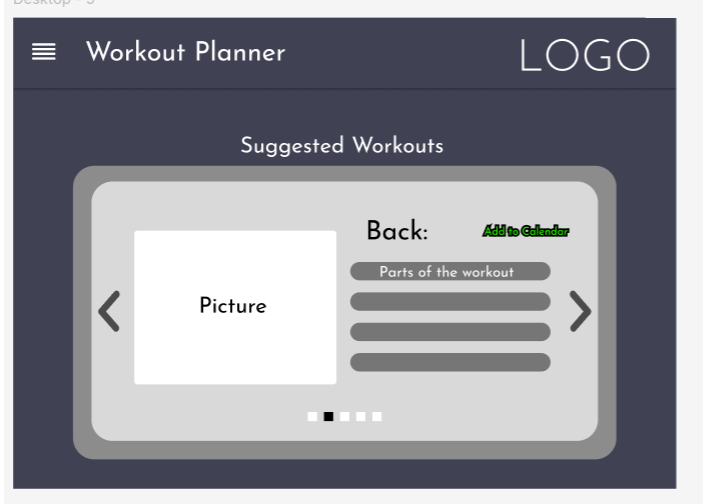
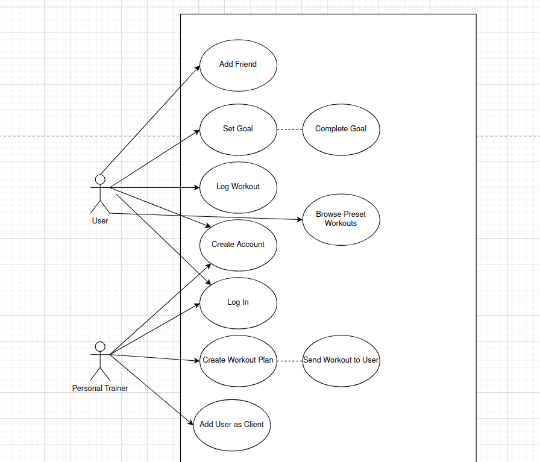
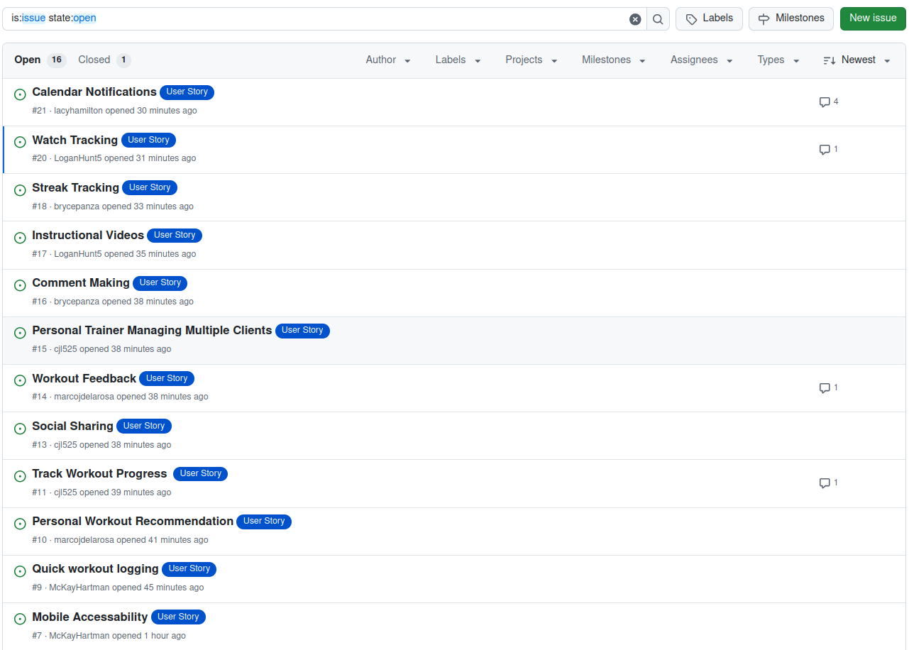

# Deliverable 2

## 1. Positioning

#### Problem Statement

The problem of **irregular or unproductive fitness sessions** affects **people who want to reach their fitness goals;** the impact of which is
**ineffective workout routines resulting in little to no progress.**

#### Production Position Statement

For **internet users** who **struggle with fitness planning, the fitness planner is a website** that **assists users in planning and developing fitness routines and setting and completing fitness goals for free** unlike **MyFitnessPal,** our product **is a free website that centralizes and automates all fitness planning functions.**

#### Value Proposition and Customer Segment

Value Proposition: We help fitness newcomers build confidence and independence by offering an online learning platform that teaches newcomers the best way to begin and supports them into becoming consistent.

Customer Segment: Fitness newcomers.

## 2. Stakeholders

- User:
  - Someone who struggles with creating workout routines and plans.
  - Does not find that keeping mental notes of fitness goals improves routines.
  - Someone who does not want to pay for expensive apps.
  - Most alternatives and competitors have monthly or annual fees that deter users.
- Personal trainers:
  - Personal trainers can use the website for each of their clients to keep track of statistics and fitness habits.
- Developer:
  - Develops, tests, maintains, and reflects on the project at every step of development.
  - Interacts with users frequently to determine best direction for the product.
- Competitor:
  - Provides a reference of a system that is not serving the gym newcomers audience well enough.
  - Creates an incentive for developing a clean and well-tailored product.

## 3. Functional Requirements (Features)

1. Website for desktop and mobile
2. Functional calendar display for planning workouts
   - Edits and additions can be made
   - Tracks past workouts
   - System to track streaks
3. Workout information pool
   - Recommendation algorithm for workouts
   - Questionnaire and calendar data collection to personalize workouts
   - Workout example videos
4. Account system
   - Ability to create, personalize, and delete account
   - Account info should have customizable visibility to other users (Users should decide what information that they want friends to be able to see)
   - System to track progress of other users for friends and personal trainers

## 4. Non-Functional Requirements

1. Portability

   - Goal: Website is usable on both desktop AND mobile devices and all main features are availible to mobile devices.

2. Usability

   - Goal: Navigatable without external guidance. Use should be intuitive and require minimal documentation.

3. Availability

   - Goal: Downtime of servers is kept to a minimum of 1 hour per week.

4. Securability
   - Goal: Each users data can only be accessed by that user.

## 5. Minimum Viable Product

- Personal User Accounts/Login:
  - Every user will have a unique username and password.
  - A user can only sign in to their account if they provide the correct password.
  - Testing and validation:
    - Several accounts will be created with unique passwords.
    - Provide the system with many incorrect strings for the password. The system must be confirmed the fail log-in.
    - Provide the system with the correct string for the password. The system must be confirmed to pass log-in.
- Calendar System for Tracking Consistency:
  - Website must contain a live calender representing the current month and year correctly.
  - Users should be able to view and edit their own personal plan using the calender.
  - Visual representation for each workout as being in a completed, incompleted, or upcoming state.
  - Testing and validation:
    - Calender should provide accurate display of the month when given a specific date as an input.
    - Verify correct state change for each workout by changing completion statuses and given dates for each goal. This data should be tracked for each user.
    - Test that a given workout plan input is saved to an account's calender. Verify changes, additions, and deletions are saved for the account.
- Goal Progress Tracker:
  - User completion data should be saved over some time interval (daily, weekly, monthly, etc).
  - Visually express completion data in some segment of the website. Provide the user with their current workout "streak", how often they complete or miss a workout, or some kind of completion data pertaining to consistency.
  - Testing and validation:
    - Verify that all completion data for an account from the calender section is accessible and readable.
    - Test that multiple events (such as a completion or a failure to complete) are saved to a shared pool only under within the specified time window. Verify that the data does not reset before the time window has elapsed.
- Workout Recommendation System:
  - Create a system that will recommend a saved workout from a pool of workouts to a user based on their activity.
  - Users will be able to add a "tag" to their workout to classify it.
  - Website should be able to produce several recommended workouts from an accessible pool. Recommendations will be based on user completion data and tags in order to assure user-tailored accuracy and customer satisfaction.
  - Testing and validation:
    - Confirm that completion data is accessible.
    - Test that a given workout pool is saved and updated based on changes made.
    - Verify that the same pool is opened on different log-ins on the same account and on different accounts.
    - Create user completion data ranging from moderate to extreme conditions. Verify that produced recommendations follow the predefined expectations.

## 6. Use Cases

### **Use Case 1: User Registration and Login**

- **Actor**: User
- **Precondition**: User is not registered on the platform.
- **Description**: The user creates a personal account by providing a unique username and password. After registration, the user logs in by entering their credentials.
- **Flow of Events**:
  1. The user navigates to the registration page.
  2. The user enters personal details (username, password, email) and clicks "Submit."
  3. The system validates the information and creates an account.
  4. The user is redirected to the login page.
  5. The user logs in using the username and password.
  6. The system verifies the credentials and grants access.
- **Postcondition**: The user is successfully logged into their account.
- **Exceptions**:
  - Invalid username/password: Display an error message and prompt for re-entry.

### **Use Case 2: Workout Calendar and Planning**

- **Actor**: User
- **Precondition**: The user is logged into their account.
- **Description**: The user can view, edit, and plan workouts on a calendar.
- **Flow of Events**:
  1. The user accesses the calendar page.
  2. The system displays a calendar showing the current month and year.
  3. The user selects a day to add a workout.
  4. The user enters workout details and saves it.
  5. The system updates the calendar to reflect the new workout.
  6. The user can edit or delete workouts as needed.
- **Postcondition**: The workout is successfully added, edited, or deleted from the calendar.
- **Exceptions**:
  - Invalid data: The system displays an error and prompts for corrections.

### **Use Case 3: Tracking Goal Progress**

- **Actor**: User
- **Precondition**: The user is logged into their account and has entered workout goals.
- **Description**: The user can track their progress toward fitness goals.
- **Flow of Events**:
  1. The user navigates to the progress tracking page.
  2. The system displays the user's current goal progress, including completion rates.
  3. The user can view detailed progress data over a specific time interval.
  4. The user can see visual representations such as streaks or performance graphs.
  5. The system updates the progress data as workouts are completed.
- **Postcondition**: The user’s goal progress is updated and displayed.
- **Exceptions**:
  - No data available: Display a message prompting the user to log their workout progress.

### **Use Case 4: Workout Recommendation System**

- **Actor**: User
- **Precondition**: The user is logged in and has a workout history.
- **Description**: The system recommends workouts to the user based on their activity and progress.
- **Flow of Events**:
  1. The user accesses the workout recommendation page.
  2. The system analyzes the user’s workout history and progress.
  3. The system generates a list of recommended workouts.
  4. The user selects a recommended workout.
  5. The system provides details and instructions for the workout.
- **Postcondition**: The user is presented with a recommended workout.
- **Exceptions**:
  - No workout history: The system suggests basic workouts for beginners.

### **Use Case 5: User Profile and Privacy Settings**

- **Actor**: User
- **Precondition**: The user is logged in and has an existing profile.
- **Description**: The user can view and adjust the visibility of their profile and fitness data.
- **Flow of Events**:
  1. The user accesses the profile settings page.
  2. The system displays the user’s personal information and fitness data.
  3. The user can adjust privacy settings to control who can view their profile and data.
  4. The user saves any changes to their privacy settings.
- **Postcondition**: The user’s privacy settings are updated.
- **Exceptions**:
  - Invalid data: The system prompts the user to re-enter valid information.
    

### **Use Case 6: User Logout**

- **Actor**: User
- **Precondition**: The user is logged in.
- **Description**: The user logs out of their account to end the session.
- **Flow of Events**:
  1. The user clicks the "Logout" button.
  2. The system ends the session and redirects the user to the homepage.
- **Postcondition**: The user is logged out and cannot access their account without logging in again.
- **Exceptions**:
  - Logout failure: The system displays an error message if logout fails.

## 7. User Stories

As a user, I would like the program to connect to send calendar notifications to my email address so I can be notified what my workouts should be for the week.

- Priority: Low
- Estimated Effort: 3

As a user, I want to be able to upload workouts directly from my Apple watch so I don't have to manually input everything.

- Priority: Low
- Estimated Effort: 21

As someone who has had trouble maintaining consistency at the gym in the past, I would like some way to track my performance of maintaining my goal.

- Priority: Low
- Estimated Effort: 1

As a Beginner, I want to be able to find videos about the exercises I'm going to do, so that I can know how to do an exercise correctly.

- Priority: Medium
- Estimated Effort: 3

As a newcomer, I want to be able to leave comments on my workouts before and after to track my progress.

- Priority: Medium
- Estimated Effort: 1

As a personal trainer, I want to manage multiple clients accounts so that I can monitor their progress.

- Priority: Medium
- Estimated Effort: 8

As a beginner, I want to know if the workouts I'm doing are optimal for my growth (like a score).

- Priority: Medium
- Estimated Effort: 13

As a user, I want to be able to share my achievements with friends on the website.

- Priority: Low
- Estimated Effort: 3

As a user, I want to track my workout progress so that I can see improvements over time.

- Priority: High
- Estimated Effort: 5

As a beginner, I want to know the best workouts to do for my growth.

- Priority: High
- Estimated Effort: 8

As someone who doesn't have time to sit down for a long time to detail my workout, I want to be able to quickly record my workout without having to make many details so that I can be more consistent in my goal progress.

- Priority: Medium
- Estimated Effort: 2

As a person who works out at a gym, I want to be able to use the website on my phone so that I can update my data at the gym.

- Priority: High
- Estimated Effort: 21

## 8. Issue Tracker

https://github.com/McKayHartman/Fitness-Website/issues

